<div align="center">


<table>
<tr>

<td width="45%" align="center" valign="middle">


</td>

<td width="55%" align="center" valign="middle">



</td>

</tr>
</table>

<br/>

[](https://linkedin.com/in/nishchal-g-741a64107)
[](https://github.com/nishchal-gond)
[](https://hashnode.com/@nishchal-gond)
[](https://instagram.com)

<br/>


</div>

<br/>

## 🕸️ About Me


> *Somewhere between the Shire and the Matrix, with a web-shooter in one hand, I write backend systems.*

I'm a Software Engineer working across frontend, backend, AI systems, and cloud-native applications. I enjoy building scalable, maintainable software with a strong focus on clean architecture and end-to-end product ownership — from APIs and databases to frontend interfaces and deployment pipelines.

**Core focus areas**


|---|---|
| 🏗️ Clean Architecture | Fellowship-grade systems built to survive the journey |
| ⚡ Backend Engineering | Reliable APIs, spun up faster than a web-shooter reload |
| 🚀 Performance | Optimized like a system that's seen behind the code |
| 🎨 Developer Experience | Tooling that makes the whole team swing a little easier |
| 🔄 Product Ownership | Requirements → design → ship → monitor, start to Mordor |

<br/>

## ⚡ Tech Stack

<table>
<tr>
<td valign="top" width="50%">

**Frontend**


**Backend & Databases**


</td>
<td valign="top" width="50%">

**Cloud / DevOps / Tools**


**AI / LLM Engineering**


</td>
</tr>
</table>

<br/>

## 🧭 How I Build End-to-End Features

```text
1. Understand requirements & user flows      → Read the map before the journey
2. Design APIs & data models                 → Forge the ring, know its power
3. Implement backend services                → Build the engine room
4. Build responsive frontend interfaces      → Give it a face worth seeing
5. Handle edge cases & failure states        → Expect an ambush at every gate
6. Optimize performance & scalability        → Faster than a swing across the skyline
7. Deploy & monitor applications             → Send it off, watch it fly
```

<br/>

## 🛠️ Backend Experience

- REST API development using Node.js / Express
- Backend systems using Java & Python
- Authentication & authorization
- SQL & NoSQL database design
- Cloud-native architectures
- AI integrations & automation systems
- Caching, failure handling, and scaling fundamentals

<br/>

## 🚀 Featured Projects

| Project | Description | Stack |
|---|---|---|
| **SmartRide Manager** | Bike maintenance tracking app | React Native, Firebase |
| **J.A.D.E** | AI assistant for automation | Python |
| **Chat With PDF** | RAG PDF chatbot using FAISS + Claude | Bedrock, LangChain |
| **IPFS IMG Upload** | Secure image uploader using IPFS | JavaScript, Web3 |
| **EDUBot** | AI-powered learning chatbot | Python |
| **Portfolio** | Personal developer portfolio | HTML, CSS, JS |

<br/>

## 📊 GitHub Analytics


<div align="center">


<br/><br/>


</div>

### Highlights

<div align="center">


</div>

<br/>

## 📡 Currently Learning

`Scalable Frontend Architecture` `System Design` `Docker & CI/CD` `Advanced TypeScript` `AI Agent Systems`

<br/>

## 💬 Ask Me About

`React & Next.js` `Backend Engineering` `AI/LLM Systems` `Cloud-Native Apps` `Frontend Performance` `API Architecture` `Clean Code Practices`

<br/>

## 🎬 Quotes from the Terminal

<table>
<tr>
<td valign="top" width="33%">


> "There is no code, only algorithms waiting to be freed."

> "I took the red pill... and found the bug was in production the whole time."

</td>
<td valign="top" width="33%">


> "Not all who wander through Stack Overflow are lost."

> "One does not simply push straight to main."

</td>
<td valign="top" width="33%">


> "With great power comes a great pull request review."

> "My Spidey-sense is tingling — there's a null pointer nearby."

</td>
</tr>
</table>

<br/>

<div align="center">


<br/><br/>


</div>

<br/>

## 🔥 Fun Fact

> 90% coding, 10% wondering why it worked — and 100% sure it's the ring's fault, not mine. 🤝

<br/>

<div align="center">


<sub>✨ Code • Build • Scale • Repeat ✨</sub>

</div>
